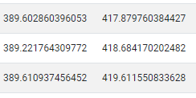
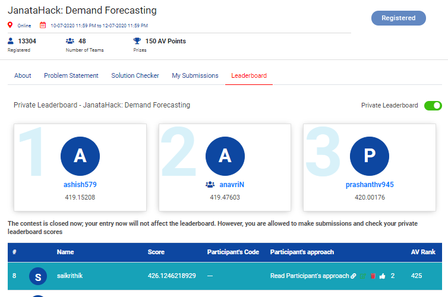

# JanataHack-Demand-Forecasting

## Rank 8th/13314 approach:
#####  PS - Could have been 1st if i would have chosen my best cv/holdout submission
One of the largest retail chains in the world wants to use their vast data source to build an efficient forecasting model to predict the sales for each SKU in its portfolio at its 76 different stores using historical sales data for the past 3 years on a week-on-week basis. Sales and promotional information is also available for each week - product and store wise. 
### The Easiest and Smallest code that could get u good score!(Cause: Stratified Kfold OOF Predictions)
[click](https://github.com/saikrithik/JanataHack-Demand-Forecasting/blob/master/LGBM.ipynb)

     
#### Tools used
- Python for programming
- numpy library for methodology
- OpenCV for reading the images and stuff.
- Lightgbm library for the model
- matplotlib and seaborn was used for plotting and analyzing the data
## Competition Result Private LB
Rank: 16th on public LB and 8th on private LB \
[Link to LeaderBoard](https://datahack.analyticsvidhya.com/contest/janatahack-demand-forecasting/#LeaderBoard)
